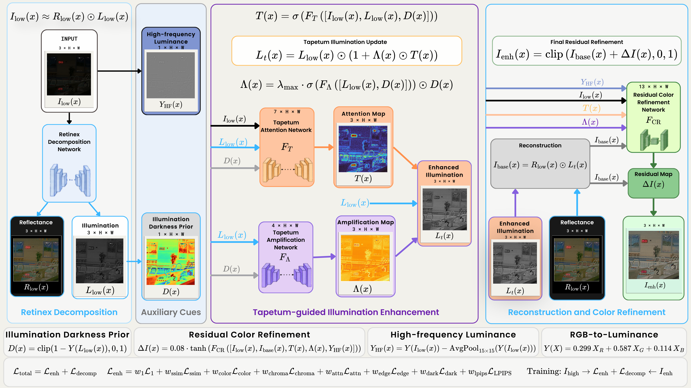

# TAPETUM

**A reproducible low-light image enhancement research workspace centered on RetinexTapetum and standardized multi-model evaluation.**

[](https://www.python.org/)
[](https://pytorch.org/)
[](https://colab.research.google.com/github/human-centered-computing/tapetum-framework/blob/main/TAPETUM/RetinexTapetum_ALL_models.ipynb)
[](LICENSE)

TAPETUM is an experimental framework for low-light image enhancement (LLIE). It brings together the proposed **RetinexTapetum** model, baseline implementations, dataset management, hyperparameter search, checkpoint selection, quantitative and visual evaluation, speed profiling, and paper artifacts under one reproducible workspace.

The repository intentionally uses a **hybrid GitHub + Google Drive layout**:

- **GitHub** stores source code, experiment logic, compact reproducibility artifacts, selected checkpoint metadata, paper figures, and comparison outputs.
- **Google Drive** stores the complete TAPETUM workspace, including large datasets, baseline repositories, checkpoints, generated images, and experiment outputs that are not practical to keep entirely in Git.
- The all-model Colab workflow contains dataset-management logic that can reconstruct supported missing datasets from configured sources when available.
- The `YEDEK` directory in Google Drive is intentionally excluded from the documented repository structure.

## Resources

- **TAPETUM repository:** https://github.com/human-centered-computing/tapetum-framework/tree/main/TAPETUM
- **Complete TAPETUM Google Drive archive:** https://drive.google.com/drive/folders/13ayyEC3V1wWdX3AXdfL8y7VqnL8eTPFT?usp=sharing
- **RetinexTapetum paper artifacts:** [paper_retinextapetum](./paper_retinextapetum)
- **Run the all-model workflow in Google Colab:** [RetinexTapetum_ALL_models.ipynb](./RetinexTapetum_ALL_models.ipynb)

## RetinexTapetum

**RetinexTapetum: A Bio-Inspired Darkness-Aware Retinex Framework for Low-Light Image Enhancement** is a compact Retinex-based LLIE model inspired by the functional light-reuse principle of the *tapetum lucidum*.

The framework does **not** attempt to simulate eye anatomy or physical optical light transport. Instead, it translates the biological motivation into an explicit, learnable, darkness-aware image-domain enhancement mechanism.

Given a low-light RGB image, the model:

1. estimates reflectance-like and illumination-like representations,
2. derives an illumination darkness prior,
3. predicts a learned three-channel tapetum response `T`,
4. predicts a darkness-gated three-channel spatial amplification map `Lambda`,
5. updates illumination using a bounded multiplicative rule,
6. recombines the Retinex components, and
7. applies bounded residual color/detail refinement.

The principal illumination update is

```text
L_t = L_low * (1 + Lambda * T)
```

where the amplification magnitude is explicitly bounded and reduced in relatively bright regions by darkness gating.

<p align="center">
  
</p>

### Model characteristics

- **Trainable parameters:** 536,463 (~0.5365 M)
- **Reported complexity:** 19.757 GMACs
- **Reported average throughput:** 29.72 FPS
- **Runtime protocol:** FP32, batch size 1, `256 x 256`, NVIDIA Tesla T4
- **Training crop:** `256 x 256`
- **Optimizer:** Adam
- **Maximum training horizon:** 120 epochs
- **Final confirmation seeds:** `42`, `123`, `3407`

## Reported RetinexTapetum Results

The selected dataset-specific checkpoints reported in the current manuscript obtain the following independent test-set results:

| Dataset | Selected seed | PSNR ↑ | SSIM ↑ | LPIPS ↓ |
|---|---:|---:|---:|---:|
| LOL-v1 | 42 | 21.0392 | 0.8316 | 0.1357 |
| LOL-v2 Real-Captured | 123 | 20.0190 | 0.8405 | 0.1258 |
| LOL-v2 Synthetic | 3407 | 25.0530 | 0.9322 | 0.0577 |
| UHD-LL down4 | 3407 | 24.7107 | 0.9115 | 0.0884 |

Across these four paired benchmarks, the manuscript reports that RetinexTapetum achieves the best SSIM and LPIPS in all four cases, while obtaining the best PSNR on LOL-v2 Synthetic and UHD-LL down4.

## Compared Methods

The TAPETUM workspace contains or references the following comparison methods:

- RetinexNet
- KinD++ (`KinD_plus` in the Drive workspace)
- URetinex-Net++ (`URetinex-Net-PLUS` in the Drive workspace)
- RetinexFormer
- RUAS
- Zero-DCE
- LIME

The common evaluation pipeline recomputes metrics from generated output images rather than mixing values copied from different publications or incompatible evaluation settings.

## Repository / Drive Structure

The structure below follows the **Google Drive TAPETUM filesystem**, except for `YEDEK`. Some directories are currently Drive-backed and therefore may not appear in a fresh GitHub clone. They can be copied from the shared Drive archive or regenerated by the relevant Colab workflow.

```text
TAPETUM/
├── README.md
├── LICENSE
│
├── RetinexTapetum/                         # Main RetinexTapetum implementation [GitHub + Drive]
│   ├── model.py
│   ├── config.py
│   ├── dataset.py
│   ├── losses.py
│   ├── train.py
│   ├── test.py
│   ├── evaluate_metrics.py
│   ├── RetinexTapetum_Ablation_Diagnostics_Dataset_Aware.py
│   └── hyper_ckpt/
│       ├── lol_v1/
│       ├── lol_v2_real/
│       ├── lol_v2_synthetic/
│       └── uhd_ll_down4/
│
├── HyperparameterSearch/                   # HPO stages, confirmation runs and summaries [GitHub + Drive]
│   ├── lol_v1/
│   ├── lol_v2_real/
│   ├── lol_v2_synthetic/
│   ├── uhd_ll_down4/
│   ├── RetinexTapetum_Implementation_Details.tex
│   ├── RetinexTapetum_LaTeX_Tables.tex
│   └── RetinexTapetum_LaTeX_Preview.pdf
│
├── paper_retinextapetum/                   # Paper figures and comparison artifacts [GitHub + Drive]
│   ├── figures/
│   └── comparison_results/
│       ├── all_models/
│       └── multi_dataset/
│
├── RetinexNet/                             # Baseline implementation [Drive]
├── KinD_plus/                              # KinD++ baseline [Drive]
├── URetinex-Net-PLUS/                      # URetinex-Net++ baseline [Drive]
├── RetinexFormer/                          # Baseline implementation [Drive]
├── RUAS/                                   # Baseline implementation [Drive]
├── Zero-DCE/                               # Baseline implementation [Drive]
├── LIME/                                   # Classical baseline [Drive]
│
├── SpeedMetrics/                           # Standardized runtime profiling [Drive]
│   ├── TAPETUM_Speed_Profiler_Colab.ipynb
│   ├── TAPETUM_Speed_Profiler_Colab.py
│   ├── LOL-v1/
│   ├── LOL-v2 Real-Captured/
│   ├── LOL-v2 Synthetic/
│   └── UHD-LL down4/
│
├── datasets/                               # Large datasets are Drive-backed
│   ├── LOL-v1/
│   ├── LOL-v2/
│   ├── UHD-LL down4/
│   ├── SICE/
│   ├── LoLI-Street/
│   ├── DICM/
│   ├── LIME/
│   ├── MEF/
│   ├── NPE/
│   ├── VV/
│   ├── info.csv
│   └── dataset_info.txt
│
├── RESULT/                                 # Canonical dataset/model outputs [Drive]
│   ├── LOL-v1/
│   ├── LOL-v2/
│   └── UHD-LL down4/
│
├── RESULTS/                                # Check/comparison result archives [Drive]
│   ├── LOL_v1(check)/
│   ├── LOL_v2_Real_captured(check)/
│   ├── LOL_v2_Synthetic(check)/
│   ├── UHD_LL_down4(check)/
│   └── LIME_default(check)/
│
├── RetinexTapetum_ALL_models.ipynb         # Main Colab-oriented all-model workflow [GitHub + Drive]
├── retinextapetum_all_models.py            # Python export of the all-model workflow [GitHub + Drive]
└── RetinexTapetum_v1 ALL models.ipynb      # Earlier Drive snapshot / legacy workflow [Drive]
```

### Excluded directory

`YEDEK/` is a backup workspace and is deliberately **not** part of the repository structure documented above.

## Dataset Organization

Paired datasets follow the standard structure expected by the RetinexTapetum training and test code:

```text
datasets/<DATASET>/
├── Train/
│   ├── Low/
│   └── Normal/
└── Test/
    ├── Low/
    └── Normal/
```

For LOL-v2, the variant level is inserted before `Train` and `Test`:

```text
datasets/LOL-v2/
├── Real_captured/
│   ├── Train/{Low,Normal}/
│   └── Test/{Low,Normal}/
└── Synthetic/
    ├── Train/{Low,Normal}/
    └── Test/{Low,Normal}/
```

Reference-free datasets such as DICM, LIME, MEF, NPE, and VV are used for cross-domain no-reference evaluation and do not require paired normal-light references.

## Checkpoints and Hyperparameter Search

Hyperparameter optimization is performed independently for the four paired training domains:

- LOL-v1
- LOL-v2 Real-Captured
- LOL-v2 Synthetic
- UHD-LL down4

The final configuration-selection protocol uses validation data only. Candidate configurations are confirmed with seeds `42`, `123`, and `3407`; the representative checkpoint is then selected using validation PSNR, SSIM, and LPIPS tolerances. Official test partitions are kept out of configuration, seed, and checkpoint selection.

Selected checkpoint material is organized under:

```text
RetinexTapetum/hyper_ckpt/<dataset>/
├── best_hyperparameters.json
├── candidate_summary.csv
├── seed_results.csv
└── checkpoints/
    ├── CHECKPOINT_SELECTION.md
    ├── seed_42/
    ├── seed_123/
    ├── seed_3407/
    └── selected/
```

The `selected/` directory is the canonical representative checkpoint location for each dataset-specific model.

## Output Organization

In the Colab/Drive workflow, RetinexTapetum uses the common result tree:

```text
/content/drive/MyDrive/TAPETUM/RESULT/
└── <dataset>/
    └── [<variant>/]
        └── RetinexTapetum/
            ├── checkpoints/
            ├── results/
            │   └── Test/
            ├── paper_metrics/
            ├── analysis/
            └── colab_run_summary.json
```

This keeps training, resume, inference, metric generation, and paper-oriented analysis under a single dataset-specific location.

## Quick Start

### Option 1 — Google Colab (recommended)

Open the all-model notebook:

[](https://colab.research.google.com/github/human-centered-computing/tapetum-framework/blob/main/TAPETUM/RetinexTapetum_ALL_models.ipynb)

The Colab workflow is designed around:

```text
/content/drive/MyDrive/TAPETUM
```

The notebook mounts Google Drive, manages the dataset workspace, and contains the multi-model evaluation pipeline. If a large folder is not present in GitHub, use the shared Drive archive as the authoritative workspace copy.

### Option 2 — RetinexTapetum training/testing from Python

Clone the repository and enter the model directory:

```bash
git clone https://github.com/human-centered-computing/tapetum-framework.git
cd tapetum-framework/TAPETUM/RetinexTapetum
```

For a local run, point results to the local TAPETUM workspace:

```bash
export RETINEX_RESULT_ROOT="$(cd .. && pwd)/RESULT"
```

Example — LOL-v1:

```bash
RETINEX_DATA_NAME=LOL-v1 \
RETINEX_DATA_VARIANT=None \
python train.py

RETINEX_DATA_NAME=LOL-v1 \
RETINEX_DATA_VARIANT=None \
python test.py
```

Example — LOL-v2 Real-Captured:

```bash
RETINEX_DATA_NAME=LOL-v2 \
RETINEX_DATA_VARIANT=Real_captured \
python train.py

RETINEX_DATA_NAME=LOL-v2 \
RETINEX_DATA_VARIANT=Real_captured \
python test.py
```

Before running locally, ensure the required dataset and checkpoint directories exist under the expected TAPETUM structure. For large assets, restore them from the shared Drive archive.

## Evaluation

The framework uses the following full-reference metrics on paired benchmarks:

- **PSNR** — higher is better
- **SSIM** — higher is better
- **LPIPS** — lower is better

The paper-oriented evaluation additionally uses no-reference criteria including NIQE, BRISQUE, PIQE, MUSIQ, MANIQA, CLIPIQA, and LOE.

Speed profiling is standardized at FP32, batch size 1, and `256 x 256` input resolution, with GPU synchronization and repeated timed inference.

## Reproducibility Notes

- Keep the full Drive workspace hierarchy intact when reproducing Colab experiments.
- Do not use `YEDEK/` as an experiment source; it is outside the canonical structure.
- Prefer dataset-associated checkpoints for same-domain benchmark reporting.
- Keep test data isolated from hyperparameter, seed, and checkpoint selection.
- Use `RetinexTapetum/hyper_ckpt/<dataset>/checkpoints/selected/` when reproducing the representative paper checkpoint.
- Large datasets, baseline repositories, generated images, and auxiliary experiment artifacts may exist only in Google Drive.
- The Python export and notebook are intended to make missing supported datasets reproducible without manually committing the datasets themselves to Git.

## Paper

**Murat DELEN and Serdar Ciftci.**  
*RetinexTapetum: A Bio-Inspired Darkness-Aware Retinex Framework for Low-Light Image Enhancement.*  
Current manuscript / research artifact, 2026.

A publication DOI or venue is intentionally not listed here until one is available.

## Citation

If you use RetinexTapetum in academic work, please cite the project/manuscript. Until a final publication record is available, the following provisional BibTeX entry can be used:

```bibtex
@article{delen2026retinextapetum,
  title   = {RetinexTapetum: A Bio-Inspired Darkness-Aware Retinex Framework for Low-Light Image Enhancement},
  author  = {Delen, Murat and Ciftci, Serdar},
  year    = {2026},
  note    = {Manuscript}
}
```

## License

This TAPETUM directory is distributed under the **GNU Affero General Public License v3.0 (AGPL-3.0)**. See [LICENSE](./LICENSE) for the complete license text.

Please preserve the applicable copyright and license notices when redistributing or modifying the code. Academic citation of RetinexTapetum is also requested when the framework contributes to published research.
